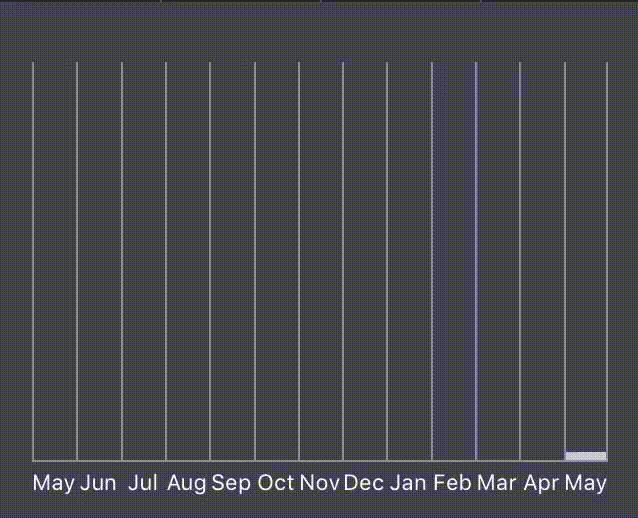

# YZBarChart
IOS framework to show simple chart bar (every can be modified different).

## Features
- Swift 4.2.
- Show simple bar chart with animation, where every bar can be modified different.
- Only vertical landscape

## Setup

**import YZBarChart**

After that you need to create worker, it is a singleton

**let notificationManager = YZNotificationManager.sharedInstance**

And now you should to add Craetor

**var configuration = YZBarChartViewConfiguration()**  

Variable to customization:
* titleTextColor - Top description text color
* titleTextAlignment - Top description text alignment
* titleFont - Top description text font
* separateLineColor - Bottom separate line color under bar chart
* maxBarCount - max count of bars to draw (if count of models will be more then maxBarCount, then bar will be average value between models)

After that you can be create barChart view

**var barChartView = YZBarChartView(configuration: configuration)**

And display datas, When you would like to draw data, you need to cerate view model - **YZBarViewModel** and configuration how this bar will be display **YZBarViewConfiguration**

**var config = YZBarViewConfiguration()**

Variable to customization:
* maxHeight - max height of bar (need equal to height of bar chart view)
* separateColor - separate color line between bars
* bckgroundColor - color under bar
* barColor - bar color
* barTouchColor - bar color when touch
* animateDuration - animation to growup bar
* descriptionBarTextColor - description text color under bar
* descriptionBarTextAlignment - Description text alignment under bar
* descriptionBarTextFont - Description text font under bar

Model **YZBarViewModel** contain X value and Y value

**var model = YZBarViewModel(x: "0.1", y: 100)**

And now you can display datas

**barChartView.displayViewModels([(model: model, config: config)], animated: true)**

## Instalation
### Cocoapods

To install it, simply add the following line to your Podfile:

pod 'YZBarChart', :git => 'https://github.com/YarZav/YZBarChart.git', :branch => 'master'

## Feedback

Feel free to create a pull request.
